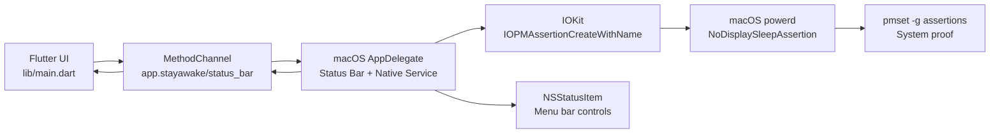

创建日期：260628

# 架构流程：StayAwake macOS 保持唤醒

## 关键链路

1. 用户点击 `Start 1 hour`。
2. Flutter 调用 `startSession`。
3. AppDelegate 创建 `NoDisplaySleepAssertion`。
4. native 返回状态，Flutter 更新 ACTIVE。
5. 用户点击 Stop 或 timer 到期。
6. AppDelegate 调用 `IOPMAssertionRelease`。
7. Flutter 回到 IDLE。
