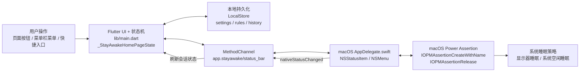
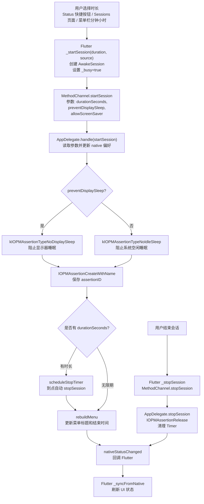
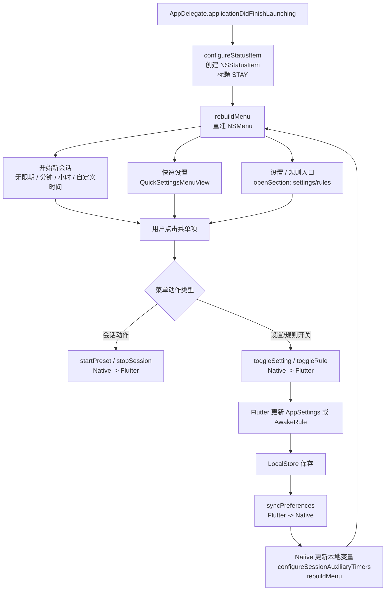
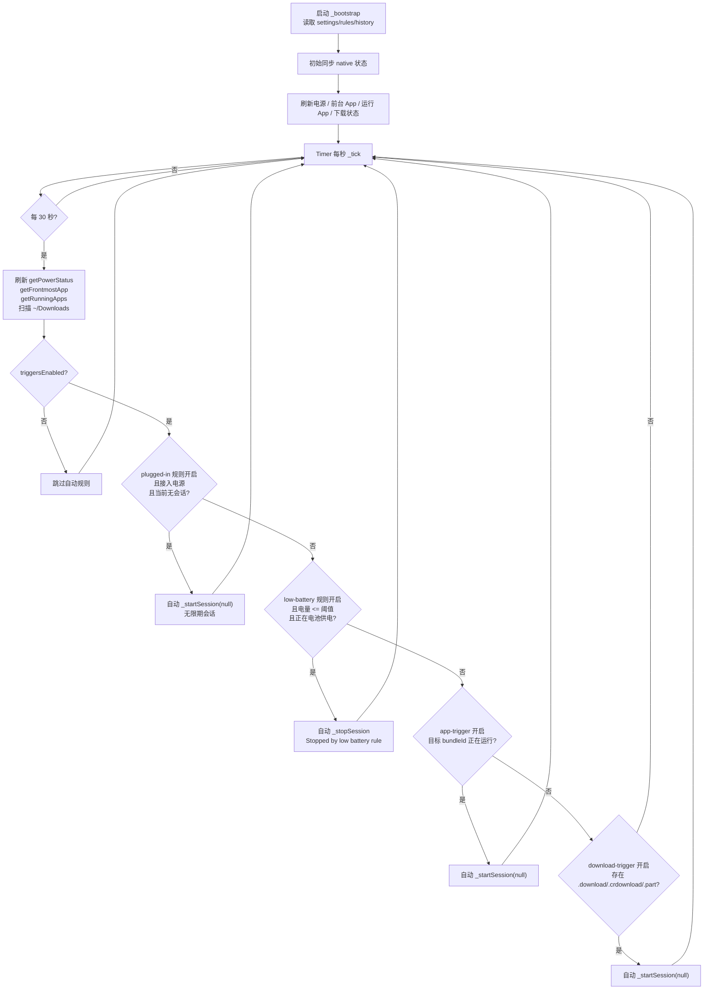
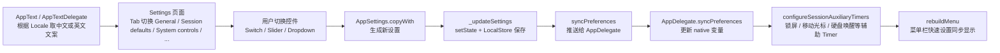

创建日期：260628

# StayAwake 技术实现流程图

## 代码依据
- Flutter 主入口：[lib/main.dart](/Users/linzhibin/Desktop/code/StayAwake/lib/main.dart)
- macOS 状态栏与系统能力：[macos/Runner/AppDelegate.swift](/Users/linzhibin/Desktop/code/StayAwake/macos/Runner/AppDelegate.swift)
- 通信通道：`MethodChannel('app.stayawake/status_bar')`
- 核心 native 能力：`IOPMAssertionCreateWithName` / `IOPMAssertionRelease`

## 1. 总架构

## 2. 手动开启或结束会话

## 3. 菜单栏与快速设置

## 4. Stay Awake Rules 自动规则

## 5. 设置页与国际化

## 6. 一句话理解每个页面

| 页面 | 技术职责 |
|---|---|
| Status | 显示当前 native assertion 和快速开始入口，核心调用 `_startSession` / `_stopSession`。 |
| Sessions | 展示预设时长和会话历史，本质仍然走同一条会话控制链路。 |
| Stay Awake Rules | 配置电源、低电量、App、下载触发规则，定时刷新状态后决定是否自动 start/stop。 |
| Settings | 管理默认会话、系统控制、触发器、硬盘唤醒、热键、通知、外观、统计数据等偏好，并同步给 native。 |
| 菜单栏 | Swift 原生 `NSStatusItem + NSMenu`，可不打开主窗口直接控制会话和快速设置。 |

## 7. 最重要的技术边界

- Flutter 不是直接阻止系统睡眠；真正生效的是 macOS native 的 `IOPMAssertionCreateWithName`。
- `MethodChannel` 是 Flutter 和 Swift 的唯一桥，所有真实系统能力都从这里过。
- 自动规则目前是本地规则，不需要后端，也没有账号同步。
- 下载规则通过扫描 `~/Downloads` 下的临时后缀判断：`.download`、`.crdownload`、`.part`。
- 设置和规则先保存在本地，再同步给 native 菜单和辅助 timer。
